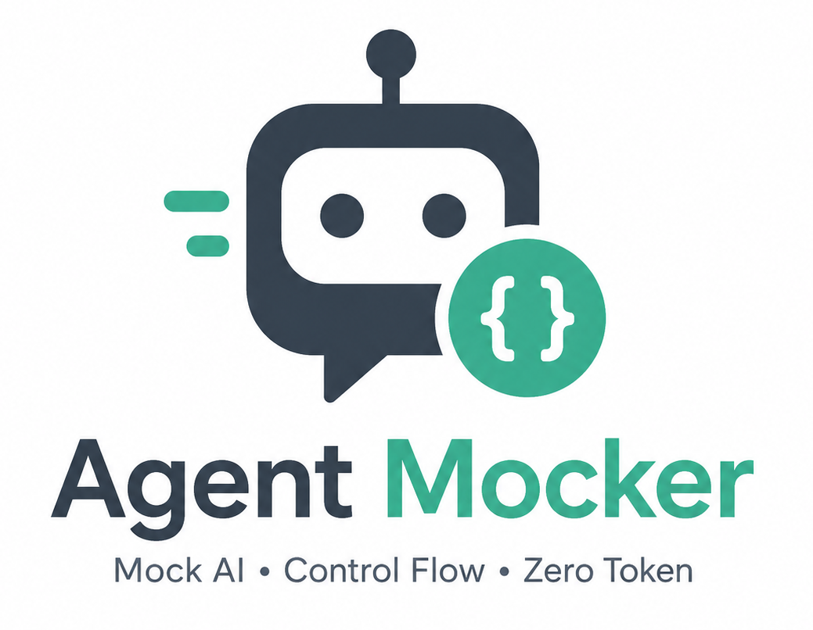

<p align="center">
  
</p>

<h1 align="center">Agent Mocker</h1>

<p align="center">
  <strong>还在为 Agent 调试烧 Token 发愁？</strong><br />
  还在等待模型“碰巧”调用 Tool，或苦于无法复现 429、超时和异常分支？<br />
  <strong>把不可控的模型响应，变成可编排、可复现、可回放的测试流程。</strong>
</p>

<p align="center">
  <strong>零 Token · 稳定复现 · 全程可观测 · 随时 Replay</strong>
</p>

<p align="center">
面向 Agent 开发的可控 AI Runtime Mock Server。它兼容 OpenAI Chat Completions API，但不调用真实 LLM(可选择转发到真实LLM)，而是通过规则、场景、人工操作和 Tool Mock 决定响应。Agent Mocker 适合用来调试和回归 Agent 的业务流程：零 Token、可重复、可观测，并且可以稳定复现 Tool Call、错误、超时、延迟和人工介入等分支。
</p>


---

## 特性

- 兼容 OpenAI Chat Completions API，通常只需修改 `base_url`。
- Rule / Scenario 驱动响应，固定输入即可得到固定行为。
- 模拟 `tool_call`、Tool Result、429、500、408、延迟和超时。
- 支持人工 Reply、Think、Tool Call、Tool Result、Error 和 Timeout。
- Session、Interaction、Event 三级时间线和请求日志。
- SSE 实时事件，工作台可以自动刷新。
- Session Replay，用于复现线上问题、准备演示和回归测试。
- SQLite 本地存储，无需额外数据库服务。

## 为什么需要它

真实 Agent 调试经常把“业务流程验证”和“模型生成质量验证”混在一起：模型输出不稳定，Tool 调用难以稳定触发，429 和超时难以复现，而且每次运行都会消耗 Token。Agent Mocker 把 AI 响应变成可编排的测试材料。

| 原有痛点 | Agent Mocker 的解决方式 | 直接收益 |
| --- | --- | --- |
| 输出不稳定，回归测试难做 | Rule / Scenario 固定条件和动作 | 同样输入得到同样行为 |
| 真实模型调用成本高 | OpenAI 兼容接口，由本地引擎生成响应 | 零 Token 调试 Agent 流程 |
| Tool Call 难以人工制造 | 人工 Tool Call 或预置 Tool 响应 | 验证参数解析、编排和重试 |
| 429、500、408 和延迟难复现 | Error / Timeout / Delay 动作 | 稳定测试异常处理和降级 |
| 多次请求散落，无法复盘 | Session → Interaction → Event 留痕 | 查看时间线、定位问题、回放过程 |

## 快速开始

### 使用 Docker 快速启动

```bash
docker run -d \
  --name agent-mocker \
  --restart unless-stopped \
  -p 3000:3000 \
  -v agent-mocker-data:/app/data \
  ikiler/agent-mocker:latest
```

启动后访问：

- Web UI：<http://localhost:3000>
- Mock API：<http://localhost:3000/v1>

SQLite 数据保存在 Docker 卷 `agent-mocker-data` 中，删除或重建容器不会丢失数据。需要运行指定版本时，将 `latest` 替换为对应版本号，例如 `1.2.3`。

### 使用源码启动

#### 环境要求

- Node.js `>= 22`
- pnpm `>= 10`

#### 安装与启动

```bash
git clone https://github.com/<org>/<repo>.git
cd <repo>
pnpm install
pnpm dev
```

启动后访问：

- Web UI：<http://localhost:5173>
- Mock API：<http://localhost:3000/v1>

首次使用时，在 Web UI 中创建一个 `Project`。项目会生成一个 `API Key`，后续 Agent 请求使用该 Key。

### 发出第一条请求

Agent Mocker 的默认示例项目使用 `sk-mock-demo`。使用 OpenAI Python SDK 的最小示例：

```python
from openai import OpenAI

client = OpenAI(
    base_url="http://localhost:3000/v1",
    api_key="sk-mock-demo",
)

response = client.chat.completions.create(
    model="gpt-4o",
    messages=[{"role": "user", "content": "帮我查询订单"}],
)

print(response.choices[0].message)
```

也可以直接运行仓库中的无第三方依赖冒烟测试：

```bash
node examples/smoke.mjs
```

指定自己的服务地址或 API Key：

```bash
MOCK_BASE_URL=http://localhost:3000 \
MOCK_API_KEY=sk-mock-xxx \
node examples/smoke.mjs
```

请求成功后，工作台中会出现一个 `Session` 和一条 `Interaction`。未指定 Session ID 时，服务端会复用最近活跃的自动会话，默认空闲窗口为 30 分钟。

### 绑定指定 Session

可以把 Session ID 拼到 URL 中，让 Agent 的请求绑定到指定会话：

```text
http://localhost:3000/<session-id>/v1
```

或者使用请求头 `X-Mock-Session-ID`。Replay 生成的专用 Session ID 也通过同样方式接入。

## 核心概念

```text
Project
├── API Key
├── Rules
├── Scenarios
├── Tools
└── Sessions
    └── Interactions
        └── Events
```

- `Project`：配置、权限和测试边界，包括规则、场景、工具和默认设置。
- `Session`：一次 Agent 运行，可结束、重新打开、删除和 Replay。
- `Interaction`：一次 HTTP 请求及其响应状态。
- `InteractionEvent`：请求内部的 `request`、`decision`、`think`、`tool_call`、`tool_result`、`assistant`、`delay`、`error` 等事件。

## 核心功能

### Rule：条件触发稳定动作

Rule 使用 `WHEN 条件 → THEN 动作` 的形式。规则按权重从小到大匹配，并优先于 Scenario。支持 `always`、`contains`、`equals`、`regex`、`model`、`tool`、`message_count`、`sequence_index`、`jsonpath`，以及 `all` / `any` / `not` 组合。

常见用法：

- `last_user_message contains "营业时间"` → 返回固定答案。
- `last_user_message contains "查订单"` → 发起 `get_order` Tool Call。
- `model equals "gpt-4o"` → `delay 800ms` 后返回 `429 rate limit`，验证退避重试和降级。


### Scenario：编排多轮流程

Scenario 适合按请求次数推进的完整业务流程。每个 Session 对每个 Scenario 维护独立游标，完成后可以选择 loop 循环。

例如退款流程可以编排为：

1. Think：先核验订单。
2. Tool Call：调用 `get_order`。
3. Tool Call：调用 `refund_order`。
4. Assistant：返回“退款已发起”。


### Tool：模拟外部系统

Tool 支持 `static`、`template`、`random`、`sequence` 和 `error` 响应，并可配置 delay。可以模拟订单、库存、支付、天气和搜索等外部依赖。

```json
{
  "status": "paid",
  "amount": 99
}
```

OpenAI 协议要求 Agent 在下一次请求中回传 Tool Result；Mock Server 不会主动推送。UI 中的 Tool Result 主要用于时间线、诊断和 Replay。


### 人工控制

对处于 waiting 状态的 Interaction，可以执行 Reply、Think、Tool Call、Tool Result、Error 和 Timeout。Think 不结束请求，可以连续发送多条；流式请求会收到 `reasoning_content` 增量。


### Session Replay

Replay 会复制一个已完成 Session 的响应轨迹，创建新的回放 Session，并按 Interaction 顺序复用源 Session 的 Mock 行为。源 Session 不会被修改，新的请求、响应和事件会独立记录。

典型流程：

1. 在 Sessions 或 Workbench 中选择一条完整的源 Session。
2. 点击“回放”，创建新的回放 Session。
3. 将 Agent 的 Session Header 改成页面提示的 `X-Mock-Session-ID`。
4. 使用相同的输入和 Tool 参数重跑 Agent。
5. 对比两个 Session 的时间线、Tool Call 参数和最终回复。

```python
client = OpenAI(
    base_url="http://localhost:3000/v1",
    api_key="sk-mock-demo",
    default_headers={"X-Mock-Session-ID": "<replay-session-id>"},
)
```


## OpenAI 兼容接口

主要接口包括：

- `POST /v1/chat/completions`
- `POST /<session-id>/v1/chat/completions`
- `GET /v1/models`
- `POST /v1/tools/:name`

管理 Web UI 使用 `/api/*` 接口；Agent 使用 `/v1/*` 兼容层。HTTP 协议处理与 Mock 决策引擎分离，便于扩展规则和响应类型。

## 配置

| 环境变量 | 默认值 | 说明 |
| --- | --- | --- |
| `MOCK_HOST` | `0.0.0.0` | 服务监听地址 |
| `MOCK_PORT` | `3000` | 服务端口 |
| `MOCK_DB_PATH` | `data/mock.db` | SQLite 文件位置 |
| `MOCK_STRICT_API_KEY` | `true` | 是否严格校验 API Key；单项目本地调试可设为 `false` |
| `MOCK_LOG_LEVEL` | `info` | 日志级别 |
| `MOCK_WEB_DIST` | `apps/web/dist` | Web 构建目录 |

示例：

```bash
MOCK_PORT=3100 MOCK_DB_PATH=/tmp/agent-mock.db pnpm dev:server
```

## 项目状态

当前项目处于早期开发阶段，适合 Agent 流程调试、Tool Call 编排测试、异常处理和重试测试、产品演示、回归测试与问题复现。它不定位为生产环境流量承载服务，也不用于评估真实模型的生成质量。

## Roadmap

- [x] OpenAI Chat Completions 兼容
- [x] Rule / Scenario 响应编排
- [x] Tool Mock、错误和延迟模拟
- [x] Session Replay
- [x] Docker 镜像
- [ ] 自动化测试报告
- [ ] 更多模型协议支持

## Docker 部署

仓库提供了生产镜像构建文件和脚本。构建镜像：

```bash
sh deploy/build.sh
```

自定义镜像名称和标签：

```bash
IMAGE_NAME=ghcr.io/<org>/agent-mocker IMAGE_TAG=0.1.0 sh deploy/build.sh
```

启动容器并持久化 SQLite 数据：

```bash
docker run --rm \
  --name agent-mocker \
  -p 3000:3000 \
  -v agent-mocker-data:/app/data \
  agent-mocker:latest
```

启动后访问 <http://localhost:3000>；Agent API 为 <http://localhost:3000/v1>。也可以通过 `MOCK_PORT`、`MOCK_LOG_LEVEL` 等环境变量覆盖默认配置。

## 开发与测试

```bash
pnpm install
pnpm dev
pnpm typecheck
pnpm build
node examples/smoke.mjs
```

仓库还提供了 LangChain / LangGraph 接入示例：

```bash
pip install langchain-openai
python examples/langgraph_agent.py
```

## 贡献

欢迎提交 Issue 和 Pull Request。提交前请确认 `pnpm typecheck` 和 `node examples/smoke.mjs` 通过，并避免提交 `data/mock.db`、构建产物和任何 API Key。

## License

本项目基于 [Apache License 2.0](LICENSE) 开源。
